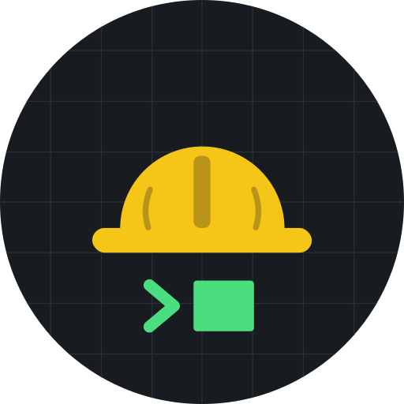

  

<h2 align="center">토목AX</h2>

읍면동 토목직이 만드는 소규모 건설공사 설계 자동화

---

### 👷 소개
경상북도 상주시 토목직 공무원입니다. 도로·배수·농업기반 시설의 자체설계(총공사비 3천만원 이하)를 하면서,
반복되는 야장 정리·도면·수량산출 작업을 코드로 자동화하고 있습니다.

### 🛠 하고 있는 일
- **소규모 건설공사 설계 자동화** — 야장 → 도면(DXF) → 수량산출서(xlsx) → 원가계산
  - 실제 설계 건을 확정 내역서와 원 단위까지 맞춰 검증하며 규칙을 쌓습니다
  - 계산은 코드가, AI는 규칙 정리·검토·문서 작성을 맡습니다
  - 👉 [sangju-estimate-public](https://github.com/lsh573928-rgb/sangju-estimate-public)
- 업무용 GPTs 제작·배포, 공공부문 AI 학습 커뮤니티 운영

### 📐 원칙
- 실제 지번·금액·업체 정보는 공개하지 않습니다
- 설계기준·표준품셈·계약 집행기준을 근거로 남깁니다
- 현장에서 바로 쓰는 것을 우선합니다

### 💬 연락
의견·제보는 저장소 Issues로 남겨 주세요.
